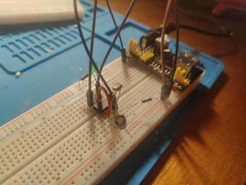
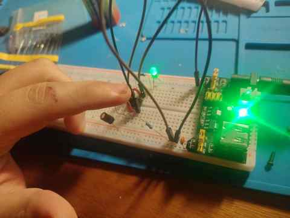

# 555 Light-to-Frequency Converter

A light-sensitive oscillator built around an NE555 timer in astable mode.

This project uses an LDR as part of the timing network so that changes in light level produce changes in oscillation frequency. The output is visualized with an LED.

No microcontroller, firmware, or software is required for the circuit itself.

## Objective

The goals of this project are to:

- Build a light-dependent oscillator using discrete electronic components
- Understand the NE555 astable timing network
- Relate LDR resistance to oscillator frequency
- Develop a mathematical model before quantitative testing
- Compare theoretical predictions with real measurements
- Practice controlled breadboard debugging
- Document uncertainty and failed attempts instead of hiding them

## Current Status

```text
v0.1 functional breadboard prototype completed.
Qualitative light-to-frequency behavior confirmed.
Quantitative characterization is pending.
```

Observed behavior:

- With more light on the LDR, the LED blinks faster
- When the LDR is covered, the LED blinks more slowly
- The LED output is clearly visible and the circuit responds immediately to large light changes

The prototype was measured at approximately `3.8 V` across the supply rails while operating. This is not considered the final characterization supply. A stable regulated supply will be used for later quantitative measurements.

## Hardware

- NE555 timer IC
- LDR photoresistor
- 10 kΩ resistor (`R_A`)
- 330 Ω LED current-limiting resistor
- 10 µF electrolytic timing capacitor
- 100 nF ceramic decoupling capacitor (`104`)
- LED
- Breadboard
- Solid-core AWG 22 wire / jumper wires
- Breadboard power module
- Multimeter

## Circuit Configuration

The NE555 is configured in astable mode.

Main connections:

```text
Pin 1 (GND)       -> GND
Pin 2 (TRIGGER)   -> timing node
Pin 3 (OUTPUT)    -> 330 Ω -> LED -> GND
Pin 4 (RESET)     -> VCC
Pin 5 (CONTROL)   -> not connected in v0.1
Pin 6 (THRESHOLD) -> timing node
Pin 7 (DISCHARGE) -> 10 kΩ to VCC and LDR to timing node
Pin 8 (VCC)       -> VCC
```

Timing network:

```text
VCC
 |
10 kΩ  (R_A)
 |
Pin 7
 |
LDR    (R_B)
 |
+------ Pin 2
|
+------ Pin 6
|
10 µF
|
GND
```

A 100 nF ceramic capacitor is connected across VCC and GND for local supply decoupling.

## Working Principle

For the standard NE555 astable configuration, the approximate oscillation frequency is:

```text
f ≈ 1.44 / ((R_A + 2R_B) C)
```

In this project:

```text
R_B = R_LDR
```

so the model becomes:

```text
f(R_LDR) ≈ 1.44 / ((R_A + 2R_LDR) C)
```

Qualitatively:

```text
more light
   -> lower LDR resistance
   -> shorter timing interval
   -> higher oscillation frequency
   -> faster LED blinking
```

and:

```text
less light
   -> higher LDR resistance
   -> longer timing interval
   -> lower oscillation frequency
   -> slower LED blinking
```

## Visual Evidence

The following photographs show the three main states used to validate the v0.1 prototype.

### 1. Normal Ambient-Light State

The complete circuit is assembled and powered under normal room lighting. The NE555, LDR, timing capacitor, resistors, LED, jumper wiring, and power module are all visible. This image serves as the main physical reference for the working breadboard prototype.



### 2. Oscillator Output — LED Active

The LED is captured while illuminated during one of the NE555 output cycles. In operation, the output repeatedly changes state, causing the LED to turn on and off. A still image cannot represent the frequency itself, but it provides visual evidence that the oscillator output stage is active.


### 3. LDR Covered — Lower Oscillation Frequency

The LDR is deliberately covered to reduce the incident light. As the illumination decreases, the LDR resistance increases. Because the LDR is part of the NE555 timing network, the capacitor takes longer to complete each timing cycle and the oscillator frequency decreases. The observed result is a visibly slower LED blink rate.

```text
less light
-> higher LDR resistance
-> longer timing interval
-> lower oscillation frequency
-> slower blinking
```



The opposite behavior was observed when more light reached the LDR: its resistance decreased and the LED blink rate increased.

For the complete annotated evidence record, see [Photo evidence](./docs/evidence.md).

## Documentation

- [System design](./docs/design.md)
- [Wiring reference](./docs/wiring.md)
- [Theory and mathematical model](./docs/theory.md)
- [Measurements](./docs/measurements.md)
- [Experiments](./docs/experiments.md)
- [Problems and debugging](./docs/problems.md)
- [Lessons learned](./docs/lessons.md)
- [Photo evidence](./docs/evidence.md)
- [Day 0 build log](./logs/day-00-project-start.md)
- [Xournal++ plan](./xournal/README.md)

## Next Steps

1. Measure the LDR resistance under controlled light conditions
2. Calculate predicted frequencies from the measured resistance values
3. Record the mathematical derivation in Xournal++
4. Export the Xournal++ pages to PDF for GitHub
5. Obtain a stable regulated supply for final measurements
6. Measure real oscillation periods/frequencies
7. Compare theoretical and experimental results
8. Calculate percentage error and discuss possible causes

## Engineering Note

The first assembly did not oscillate correctly and produced confusing supply measurements. The circuit was completely rebuilt from zero, after which the expected light-dependent behavior appeared immediately.

The exact cause of the first failure was not conclusively isolated, so this repository does not claim a specific root cause.

That uncertainty is intentionally preserved as part of the engineering record.
