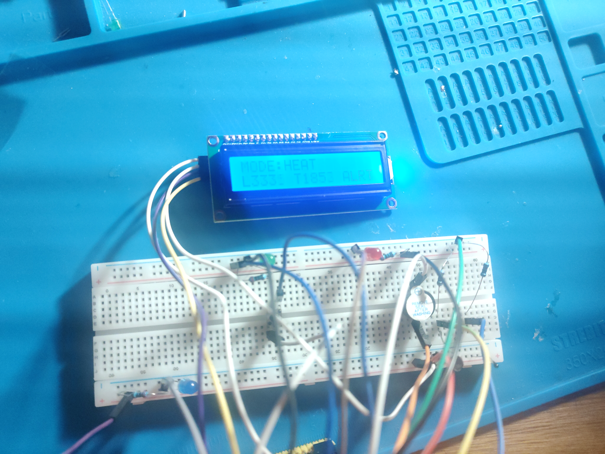
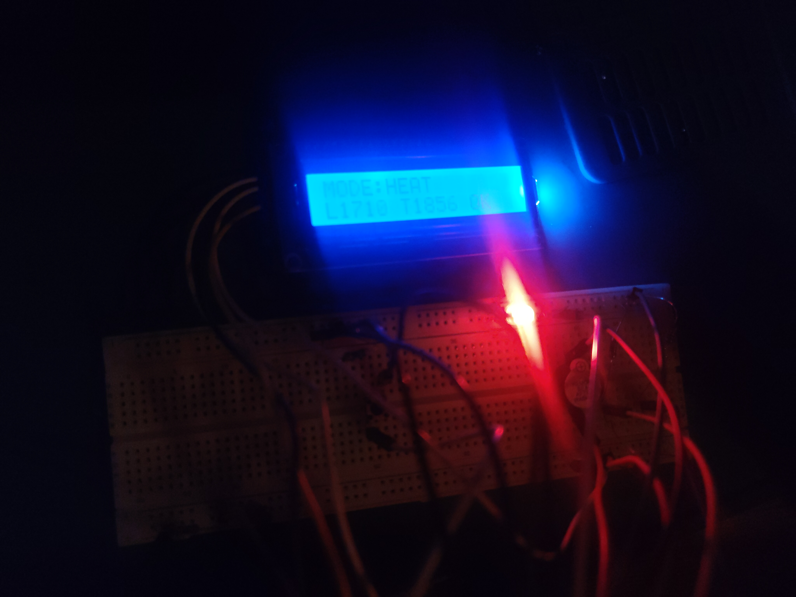
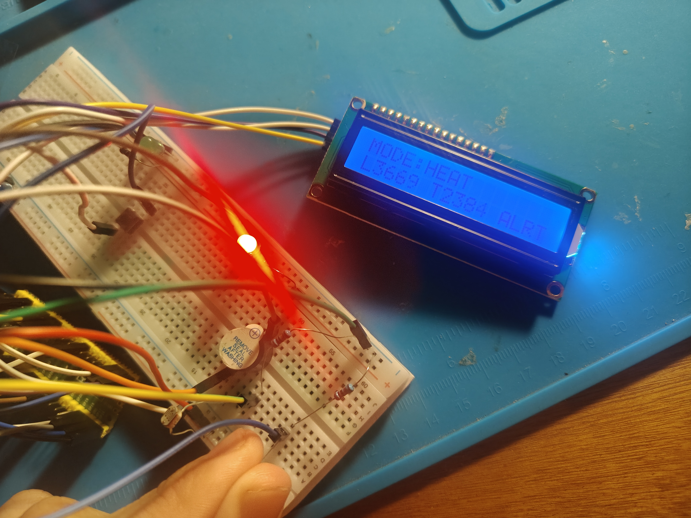
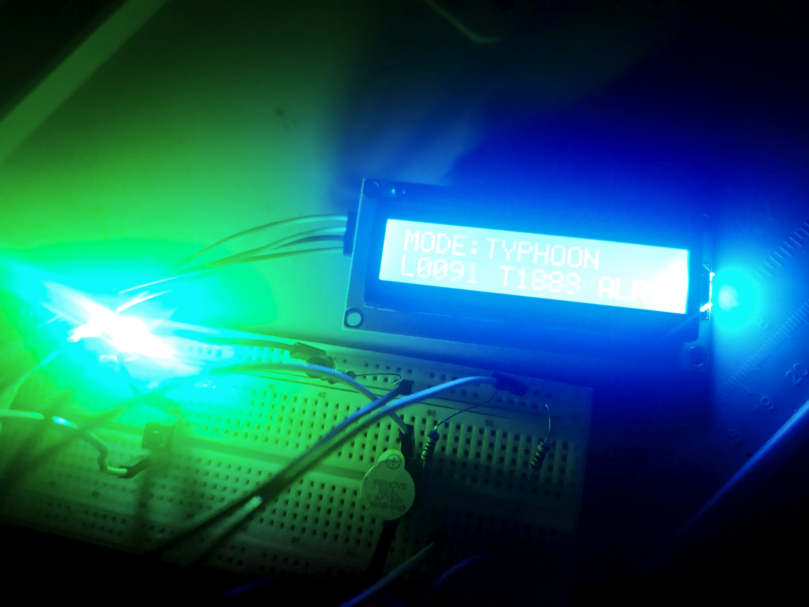
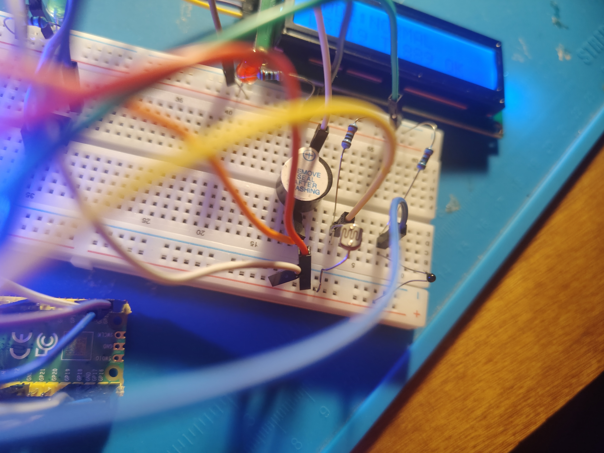
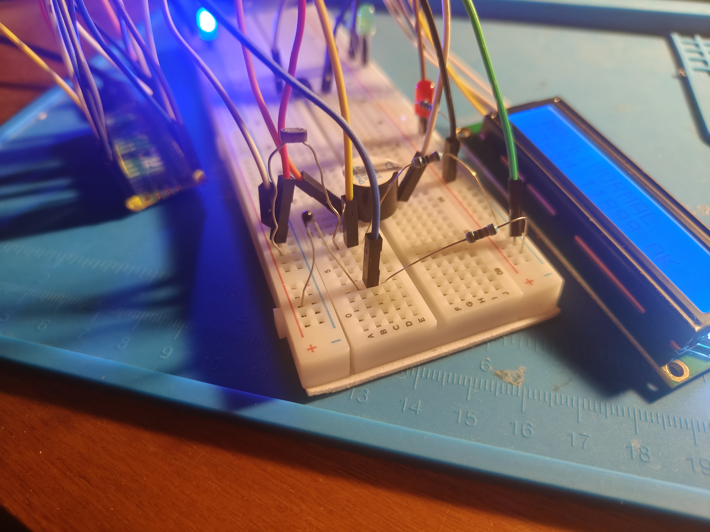
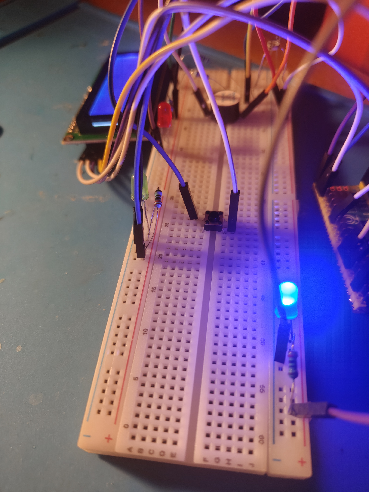

# Evidence — Pico Resilience Monitor v0

This document collects visual evidence of the Pico Resilience Monitor v0.1 functional breadboard prototype.

The purpose of this page is to show that the project was physically built, tested, debugged, and validated as a working embedded systems prototype.

---

## 1. Full Prototype Overview



Complete view of the v0.1 breadboard prototype.

This photo shows the main hardware elements of the system:

```text
Raspberry Pi Pico
Breadboard
LCD 1602 I2C display
Mode LEDs
Push button
Active buzzer
LDR light sensor
Thermistor temperature sensor
Shared 3.3V and GND rails
```

This image serves as the main visual reference for the project.

---

## 2. Heat Mode Without Alert



The system running in `URBAN_HEAT` mode without an active alert condition.

In this state, the system is monitoring for heat-related conditions, but neither high light nor high temperature has crossed the alert threshold.

Expected behavior:

```text
Mode: HEAT
Alert: OFF / OK
Heat LED steady
Buzzer inactive
```

---

## 3. Heat Alert From High Temperature



The system running in `URBAN_HEAT` mode with a high-temperature condition.

The thermistor was heated by touch, causing the temperature ADC value to rise above the configured threshold.

Relevant threshold behavior:

```text
TEMP_HIGH enters above 2200
TEMP_HIGH exits below 2000
```

Expected behavior:

```text
Mode: HEAT
Temperature: HIGH
Alert: ACTIVE / ALRT
Heat LED blinking
Buzzer beeping periodically
```

---

## 4. Typhoon Alert From Low Light



The system running in `TYPHOON_ALERT` mode with low light detected by the LDR.

This mode simulates a low-visibility alert condition.

Expected behavior:

```text
Mode: TYPHOON
Light: LOW
Alert: ACTIVE / ALRT
Typhoon LED blinking
Buzzer beeping periodically
```

This is not a real typhoon detector. It is an educational simulation of low-light / low-visibility alert logic.

---

## 5. LDR Voltage Divider



Close-up of the LDR light sensor circuit.

The LDR is connected as a voltage divider and read through `GP26_A0 / ADC0`.

Final working circuit:

```text
3V3 ── LDR ── GP26_A0 ── 100kΩ ── GND
```

This circuit was one of the most important debugging points in the project.

The initial 10kΩ resistor produced compressed ADC readings around:

```text
300–500
```

After replacing it with 100kΩ, the LDR produced a much wider and more useful range:

```text
Low light: approximately 250–320
Strong nearby lamp: approximately 3600+
```

---

## 6. Thermistor Voltage Divider



Close-up of the thermistor temperature sensing circuit.

The thermistor is connected as a voltage divider and read through `GP27_A1 / ADC1`.

Working circuit:

```text
3V3 ── thermistor ── GP27_A1 ── 10kΩ ── GND
```

Observed behavior:

```text
Resting temperature: approximately 1850
Held between fingers: approximately 2360
After release: returns near 1860
```

The thermistor is currently used through raw ADC values, not calibrated Celsius.

---

## 7. Button and Wiring



View of the button and wiring section of the breadboard.

The button is connected to `GP14` and uses the Pico internal pull-up resistor.

Button wiring:

```text
GP14 ── button ── GND
```

Firmware behavior:

```text
Button released → GPIO reads 1
Button pressed  → GPIO reads 0
```

The button cycles through the system modes:

```text
NORMAL → URBAN_HEAT → TYPHOON_ALERT → NORMAL
```

A debounce delay is used to avoid false multiple presses.

---

## Evidence Summary

The photos document the current v0.1 prototype as a working embedded system.

Validated hardware modules:

```text
Raspberry Pi Pico
Push button input
Three LED outputs
Active buzzer output
LDR analog input
Thermistor analog input
LCD I2C display
Shared 3.3V and GND rails
```

Validated firmware behavior:

```text
Mode switching
Button debounce
Finite state machine
ADC sensor reading
Light classification with hysteresis
Temperature thresholding with hysteresis
Mode-specific alert logic
LCD status display
Buzzer and LED alert output
```

---

## Current Evidence Status

This evidence supports the current project status:

```text
v0.1 — Functional breadboard prototype
```

The prototype is not a final product, but it is a working educational embedded systems project with documented hardware, firmware, calibration, debugging, and visual evidence.
